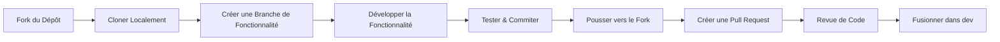

# 🛒 Amazon Clone – React E-Commerce Project  
*Une plateforme e-commerce inspirée d'Amazon, entièrement fonctionnelle, construite avec React & FakeStoreAPI*  

  
  
  
  

---

## 📋 Table des Matières
- [🌟 Aperçu du Projet](#-aperçu-du-projet)
- [🎯 Fonctionnalités Principales](#-fonctionnalités-principales)
- [🚀 Démarrage Rapide](#-démarrage-rapide)
- [📁 Structure du Projet](#-structure-du-projet)
- [🔧 Stack Technique](#-stack-technique)
- [👥 Équipe & Rôles](#-équipe--rôles)
- [🔄 Workflow Git](#-workflow-git)
- [📝 Guide de Développement](#-guide-de-développement)
- [📊 État du Projet & Feuille de Route](#-état-du-projet--feuille-de-route)
- [📞 Contact & Support](#-contact--support)
- [📜 Licence](#-licence)

---

## 🌟 Aperçu du Projet

Ce projet s'inscrit dans le parcours d'apprentissage **Afrix Global**, où nous construisons une plateforme e-commerce prête pour la production, inspirée d'Amazon. L'application démontre les bonnes pratiques du développement web moderne en utilisant React pour le frontend et FakeStoreAPI pour les données produits.


**Objectifs Principaux :**
- 🏗️ Construire une application React scalable avec une architecture de composants appropriée
- 🔐 Implémenter un système d'authentification et de gestion d'utilisateurs sécurisé
- 🛍️ Créer des flux d'achat et de paiement intuitifs
- 📊 Développer des systèmes de suivi de commandes et d'historique
- 🤝 Pratiquer les workflows Git collaboratifs en équipe

---

## 🎯 Fonctionnalités Principales

### 🔐 **Système d'Authentification**
- Inscription et connexion des utilisateurs
- Gestion sécurisée des sessions
- Routes protégées pour les utilisateurs authentifiés

### 🏪 **Catalogue de Produits**
- Navigation par catégories
- Recherche et filtrage des produits
- Pages détaillées des produits avec avis

### 🛒 **Expérience d'Achat**
- Ajout/suppression d'articles du panier
- Mises à jour en temps réel du panier
- Calcul des prix et résumés

### 📦 **Gestion des Commandes**
- Passation et confirmation de commandes
- Historique des commandes
- Mises à jour du statut des commandes

### 🎨 **Design Responsive**
- Approche mobile-first
- Interface utilisateur cohérente sur tous les appareils
- Composants accessibles

---

## 🚀 Démarrage Rapide

### Prérequis
- Node.js 16+ & npm/yarn
- Git installé
- Éditeur de code (VS Code recommandé)

### Étapes d'Installation

1. **Cloner le dépôt**
   ```bash
   git clone https://github.com/RobertKule/amazon-clone-fakestoreapi.git
   cd amazon-clone-fakestoreapi
   ```

2. **Installer les dépendances**
   ```bash
   npm install
   # ou
   yarn install
   ```

3. **Configurer les variables d'environnement**
   ```bash
   cp .env.example .env.local
   # Modifier .env.local avec votre configuration
   ```

4. **Démarrer le serveur de développement**
   ```bash
   npm start
   # ou
   yarn start
   ```

5. **Ouvrir dans le navigateur**
   Naviguer vers `http://localhost:3000`

---

## 📁 Structure du Projet

```
src/
├── 📂 assets/          # Images, icônes, polices
├── 📂 components/      # Composants UI réutilisables
│   ├── 🧩 common/      # Composants partagés (Bouton, Carte, Modal)
│   ├── 🛒 cart/        # Composants liés au panier
│   ├── 🏪 products/    # Composants d'affichage produits
│   └── 🎨 layout/      # Composants de mise en page (Navbar, Footer)
├── 📂 pages/           # Composants de pages
│   ├── 🏠 Home.js
│   ├── 🛍️ Products.js
│   ├── 🛒 Cart.js
│   ├── 📦 Orders.js
│   └── 🔐 Auth.js
├── 📂 services/        # Couche d'intégration API
│   ├── api.js         # Configuration Axios
│   ├── auth.js        # Services d'authentification
│   └── products.js    # Services produits
├── 📂 context/         # React Context pour la gestion d'état
│   ├── AuthContext.js
│   └── CartContext.js
├── 📂 hooks/          # Hooks React personnalisés
├── 📂 utils/          # Fonctions utilitaires
└── 📂 styles/         # Styles globaux & thème
```

---

## 🔧 Stack Technique

| Couche | Technologie | Objectif |
|--------|------------|----------|
| **Frontend** | React 18 | Interface utilisateur basée sur composants |
| **Gestion d'État** | React Context + Hooks | État global de l'application |
| **API** | FakeStoreAPI | Données produits & backend simulé |
| **Routing** | React Router v6 | Navigation & routage |
| **Stylisation** | Tailwind CSS | Stylisation utility-first |
| **Client HTTP** | Axios | Requêtes API |
| **Contrôle de Version** | Git + GitHub | Collaboration |
| **Qualité de Code** | ESLint + Prettier | Standards de code |

---

## 👥 Équipe & Rôles

| Membre | Rôle | Responsabilités |
|--------|------|-----------------|
| **Robert KULE** | Chef d'Équipe | Architecture, Revue de Code, Déploiement |
| **Lucien** | Développeur Frontend | Composants UI, Stylisation |
| **Fidèle** | Intégration Backend | Services API, Authentification |
| **Gloire** | Spécialiste UX/UI | Flux utilisateurs, Design Responsive |

---

## 🔄 Workflow Git

### Stratégie de Branches
```
main      → Code prêt pour la production
dev       → Branche d'intégration pour les fonctionnalités
feature/  → Nouvelles fonctionnalités (feature/auth, feature/cart)
bugfix/   → Corrections de bugs
hotfix/   → Corrections critiques pour la production
```

### Processus de Contribution



### Convention des Messages de Commit
```
feat:     Nouvelle fonctionnalité
fix:      Correction de bug
docs:     Documentation
style:    Changements de formatage
refactor: Restructuration de code
test:     Ajout de tests
chore:    Tâches de maintenance
```

---

## 📝 Guide de Développement

### Standards de Code
- Utiliser des **composants fonctionnels** avec hooks
- Suivre les **patterns de composition de composants**
- Implémenter des **Error Boundaries** pour la robustesse
- Écrire un **code propre et documenté**

### Bonnes Pratiques de Performance
- Implémenter le **code splitting** pour les routes
- Utiliser **React.memo** pour les composants coûteux
- Optimiser le **chargement des images** avec lazy loading
- Minimiser les **re-renders** avec une gestion d'état appropriée

### Stratégie de Test
- Tests unitaires pour les fonctions utilitaires
- Tests de composants avec React Testing Library
- Tests d'intégration pour les flux utilisateurs
- Tests manuels sur plusieurs appareils

---

## 📊 État du Projet & Feuille de Route

### ✅ Terminé
- [x] Configuration du projet
- [x] Structure de routing de base
- [x] Page de liste des produits
- [x] Fonctionnalité de panier de base

### 🔄 En Cours
- [ ] Système d'authentification utilisateur
- [ ] Processus de paiement
- [ ] Suivi des commandes
- [ ] Polissage du design responsive

### 📅 Planifié
- [ ] Intégration de paiement (Stripe/Mpesa)
- [ ] Avis & évaluations des produits
- [ ] Recherche avancée & filtres
- [ ] Tableau de bord administrateur
- [ ] Fonctionnalités PWA

---

## 📞 Contact & Support

### Communication d'Équipe
- **Standups Quotidiens** : 9:00 GMT+2
- **Sync Hebdomadaire** : Vendredis, 16:00 GMT+2
- **Outil de Communication** : Slack/WhatsApp

### Signalement de Problèmes
1. Vérifier les issues existantes pour éviter les doublons
2. Utiliser le template d'issue
3. Fournir des captures d'écran pour les problèmes UI
4. Inclure les étapes pour reproduire le problème

### Obtenir de l'Aide
- Consulter le [Wiki](https://github.com/RobertKule/amazon-clone-fakestoreapi/wiki)
- Rejoindre nos [Discussions](https://github.com/RobertKule/amazon-clone-fakestoreapi/discussions)
- Contacter le Chef d'Équipe : Robert KULE

---

## 📜 Licence

Ce projet est développé à des **fins éducatives** dans le cadre du programme de formation Afrix Global.

```
Copyright 2024 Afrix Global - Groupe 1

L'utilisation à des fins éducatives est autorisée.
L'utilisation commerciale, la distribution ou la modification
sans autorisation écrite expresse sont interdites.
```

---

<div align="center">

### 🌟 **Étoilez ce dépôt si vous le trouvez utile !** 🌟

[](https://star-history.com/#RobertKule/amazon-clone-fakestoreapi&Timeline)

</div>

---

*Construit avec ❤️ par Afrix Global - Groupe 1 | Autonomiser les développeurs par des projets pratiques*
